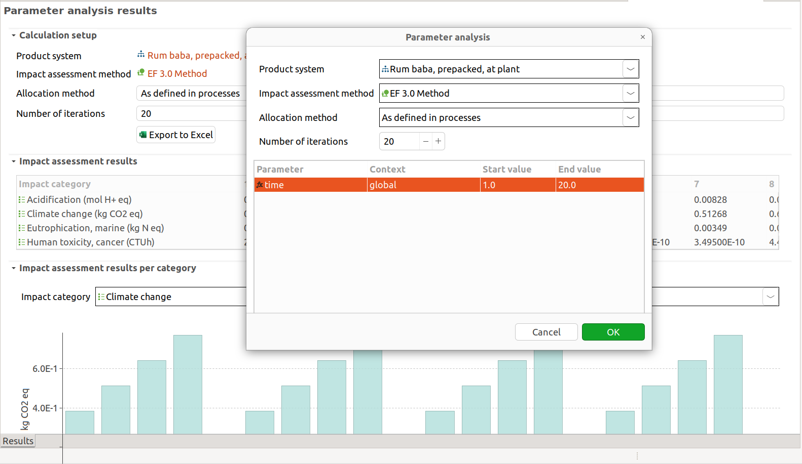

# FCH-LCA Tool

This repository contains the source code of the _FCH-LCA Tool_ developed in the [SH2E project](https://sh2e.eu/project/). It is based on [openLCA v2+](https://openLCA.org) but contains unique features specifically developed for the SH2E project which are described below. For a general introduction to openLCA see the resources on the openLCA website or the openLCA manual.

**Note:** The tool is based on a newer database version than the current openLCA version. If you open an existing database with the tool, it will run a database upgrade that is **not compatible** with the current openLCA version. Thus, make a backup of a database before running the update (the tool will ask you for this).


## Features

### Guided wizards and product system templates

The tool contains many product system templates for modeling hydrogen systems. For selecting a template for a specific modeling question, the user can go through a guided wizard that asks for the model details and will provide the respective template based on the answers. The wizard can be started by clicking the respective link in the start page or the button in the toolbar:


From the selected template, the tool will then create a product system which can be then further edited. The collected information from the wizard are added as meta-data to the product system so that the model can be checked later against these properties:


### Next level social life cycle assessment

The tool provides a new feature for social life cycle assessment that is directly based on social aspects of processes (no specific elementary flows need to be added anymore!). It combines life cycle attribute assessment of social risk values and raw value aggregation based on per-indicator activity variables. The results of this assessment are presented in a new tree visualization where assessment results can be tracked down from high-level social categories to specific process contributions:


This feature directly works with current databases like [soca](https://nexus.openlca.org/database/soca) or [PSILCA](https://nexus.openlca.org/database/PSILCA), just run a calculation and it will show the new result view. However, future versions of these databases would not need specific elementary flows anymore, these are redundant currently, and could provide an integrated assessment of environmental, social, and economic impacts of a system in a single calculation.


### Parameter analyses and time

Under `Tools > Parameter analysis` it is possible to run calculations over specific parameter ranges. With this it is for example possible to introduce a time variable in formulas for product inputs etc. that are based on this variable (e.g. a service input every 5 years) and calculate results over a specific time span (e.g. 1 to 20 years):




## Building from source

For general information regarding building the tool from source, see the [repository of the openLCA application](https://github.com/GreenDelta/olca-app). The tool is based on the `propext` (_property extensions_) branch of the openLCA project. In this branch, additional properties can be stored as extensions (in a simple JSON object) of data sets like flows, processes, product systems, etc. To fetch upstream updates from this `propext` branch, you can do the following:

```bash
# add the openLCA repository as 'upstream' repository
git remote add upstream https://github.com/GreenDelta/olca-app.git

# fetch updates and merge them
git fetch upstream
git merge upstream/propext
```
